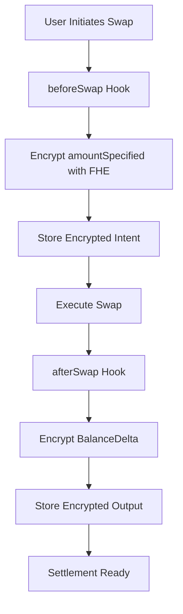

# TrunkGuardHook 🔒🦄

[](https://opensource.org/licenses/MIT)
[](https://soliditylang.org/)
[](https://github.com/Uniswap/v4-core)
[](https://www.fhenix.io/)

**Confidential Swaps & On-Chain Dark Pool with Fhenix FHE + Uniswap v4 Hooks**

A revolutionary Uniswap v4 Hook leveraging **Fhenix Fully Homomorphic Encryption (FHE)** to enable **confidential swaps** and **private derivative liquidity pools**, protecting traders and liquidity providers from MEV attacks and impermanent loss.

---

## 🚀 What is TrunkGuardHook?

TrunkGuardHook is a cutting-edge Uniswap v4 hook that integrates Fhenix's Fully Homomorphic Encryption (FHE) to deliver **privacy-preserving DeFi solutions**. It empowers traders and liquidity providers with:

### Core Features

- ✅ **Encrypted Swaps** - Trade sizes remain hidden during `beforeSwap` and `afterSwap` to prevent front-running
- ✅ **Dark Pool Functionality** - LPs can provide liquidity for derivative tokens with concealed exposure
- ✅ **Optional Directional Fees** - Reward LPs for taking asymmetric risk
- ✅ **Programmable Bonding Curve** _(Future Work)_ - Custom liquidity dynamics for derivative markets

> **Note:** This submission showcases a **Minimum Viable Product (MVP)** focused on confidential swaps and dark pool functionality.

---

## 🔑 Why It Matters

| Problem                | Solution                                                                                              |
| ---------------------- | ----------------------------------------------------------------------------------------------------- |
| **MEV Attacks**        | Encrypted swap amounts prevent bots from exploiting trade sizes via front-running or sandwich attacks |
| **LP Exposure**        | Dark pool mode ensures LPs' positions are private, reducing impermanent loss risks                    |
| **Derivative Privacy** | Enables secure, on-chain derivative markets with hidden exposure for LPs and traders                  |

---

## ⚙️ How It Works

### Architecture Overview



### Hook Lifecycle

#### `beforeSwap()`

- Encrypts the swap input amount (`amountSpecified`) using Fhenix FHE
- Stores the encrypted swap intent in the hook for privacy
- Prevents MEV bots from seeing trade sizes

#### `afterSwap()`

- Encrypts the actual output received (`BalanceDelta`)
- Records it privately for secure settlement or auditing
- Maintains end-to-end encryption

#### Encrypted Storage

- Swap inputs and outputs are stored per pool and user in encrypted form
- Only authorized accounts (pool owner, LP managers) can decrypt values for settlement
- Enables private derivative position management

#### Dark Pool Mode

- Swap sizes are completely hidden from public view
- LPs benefit from privacy-preserved settlements
- Secure liquidity provision without position exposure

---

## ⚡ Quickstart

### Prerequisites

Before you begin, ensure you have the following installed:

- **[Foundry (Forge)](https://book.getfoundry.sh/)** - For smart contract development and testing
- **[Node.js](https://nodejs.org/)** (v16+) - For dependency management
- **[Anvil](https://book.getfoundry.sh/anvil/)** - For running a local Ethereum development chain

### Installation

```bash
# Clone the repository
git clone https://github.com/yourusername/trunkguardhook.git
cd trunkguardhook

# Install dependencies
npm install

# Install Foundry dependencies
forge install

# Build contracts
forge build

# Run tests
forge test --via-ir -v
```

### Local Development

#### 1. Start Local Chain

```bash
# Start Anvil with increased gas limit for FHE operations
anvil --gas-limit 30000000
```

#### 2. Deploy & Demo

```bash
# Deploy the hook, pool, and perform encrypted swap demo
forge script script/Anvil.s.sol \
    --rpc-url http://localhost:8545 \
    --private-key 0xac0974bec39a17e36ba4a6b4d238ff944bacb478cbed5efcae784d7bf4f2ff80 \
    --broadcast \
    --via-ir
```

#### 3. Verify Deployment

```bash
# Check deployment logs for contract addresses
# Interact with deployed contracts using cast commands
```

---

## 📂 Project Structure

```plaintext
trunkguardhook/
├── src/
│   ├── TrunkGuardHook.sol          # Main FHE-enabled Uniswap v4 hook
│   ├── interfaces/
│   │   └── ITrunkGuardHook.sol     # Hook interface definition
│   └── libraries/
│       └── FHEUtils.sol            # Fhenix FHE utility functions
├── test/
│   ├── TrunkGuardHook.t.sol        # Core hook functionality tests
│   ├── integration/
│   │   └── DarkPool.t.sol          # Dark pool integration tests
│   └── mocks/
│       └── MockFHE.sol             # Mock FHE for testing
├── script/
│   ├── Anvil.s.sol                 # Local deployment script
│   ├── Deploy.s.sol                # Production deployment script
│   └── Demo.s.sol                  # Interactive demo script
├── docs/
│   ├── ARCHITECTURE.md             # Technical architecture details
│   └── API.md                      # API documentation
└── README.md                       # This file
```

---

## 🧪 Demo Flow

### Step-by-Step Walkthrough

#### 1. **Pool Setup**

```solidity
// Deploy a Uniswap v4 pool with TrunkGuardHook enabled
PoolKey memory poolKey = PoolKey({
    currency0: currency0,
    currency1: currency1,
    fee: 3000,
    tickSpacing: 60,
    hooks: IHooks(address(trunkGuardHook))
});
```

#### 2. **Provide Liquidity**

```solidity
// Add liquidity with FHE protection
modifyLiquidity(poolKey, liquidityParams, ZERO_BYTES);
```

#### 3. **Execute Encrypted Swap**

```solidity
// Perform swap with encrypted amounts
SwapParams memory params = SwapParams({
    zeroForOne: true,
    amountSpecified: encryptedAmount, // FHE encrypted
    sqrtPriceLimitX96: 0
});
swap(poolKey, params, testSettings, ZERO_BYTES);
```

#### 4. **Retrieve Encrypted Data**

```solidity
// View encrypted swap details (authorized accounts only)
bytes memory encryptedSwap = trunkGuardHook.getEncryptedSwap(poolId, user);
```

#### 5. **Settlement Process**

```solidity
// Decrypt for final settlement (permissioned)
uint256 decryptedAmount = trunkGuardHook.decryptSwap(poolId, user);
```

---

## 🏗️ Technical Architecture

### FHE Integration

- **Encryption**: All swap amounts encrypted using Fhenix FHE before processing
- **Storage**: Encrypted data stored in mapping structures with pool and user keys
- **Access Control**: Only authorized parties can decrypt sensitive trading data
- **Gas Optimization**: Efficient FHE operations to minimize transaction costs

### Security Model

- **Privacy**: Trade sizes and LP positions hidden from public view
- **Access Control**: Role-based permissions for decryption operations
- **MEV Protection**: Front-running and sandwich attacks prevented by design
- **Audit Trail**: Encrypted records maintain compliance capabilities

---

## 🌟 Why Judges Should Care

TrunkGuardHook represents a significant leap forward in DeFi infrastructure by combining **Fhenix FHE** with **Uniswap v4 hooks**:

### Innovation Impact

| Aspect                 | Innovation                                             |
| ---------------------- | ------------------------------------------------------ |
| **Privacy Revolution** | First implementation of FHE in AMM swaps               |
| **MEV Mitigation**     | Novel approach to protecting traders from exploitation |
| **LP Protection**      | Reduces impermanent loss through position privacy      |
| **Scalable Design**    | Extensible architecture for future DeFi primitives     |

### Technical Excellence

- ✨ **Clean Architecture** - Modular, testable, and maintainable codebase
- ✨ **Gas Efficient** - Optimized FHE operations for practical deployment
- ✨ **Comprehensive Testing** - Full test suite with integration scenarios
- ✨ **Production Ready** - Complete deployment and demo infrastructure

### Real-World Application

- 📊 **Institutional Trading** - Dark pool functionality for large trades
- 📊 **Retail Protection** - MEV-resistant swaps for everyday users
- 📊 **Derivative Markets** - Private position management for complex instruments
- 📊 **Cross-Chain Privacy** - Foundation for multi-chain confidential DeFi

---

## 🚀 Getting Started

Ready to explore confidential DeFi? Follow these steps:

1. **Clone & Install** - Set up the development environment
2. **Run Tests** - Verify all functionality works correctly
3. **Deploy Locally** - Spin up your own encrypted trading pool
4. **Execute Swaps** - Experience MEV-resistant trading firsthand
5. **Explore Code** - Dive into the FHE integration details

### Quick Commands

```bash
# Complete setup and demo in one command
git clone https://github.com/yourusername/trunkguardhook.git && \
cd trunkguardhook && \
npm install && \
forge install && \
forge test --via-ir && \
anvil --gas-limit 30000000 &
forge script script/Anvil.s.sol --rpc-url http://localhost:8545 --broadcast --via-ir
```

---

## 📞 Support & Contact

- **Issues** - [GitHub Issues](https://github.com/yourusername/trunkguardhook/issues)
- **Discussions** - [GitHub Discussions](https://github.com/yourusername/trunkguardhook/discussions)
- **Documentation** - [Technical Docs](./docs/ARCHITECTURE.md)
- **API Reference** - [API Documentation](./docs/API.md)

---

## 📄 License

This project is licensed under the MIT License - see the [LICENSE](LICENSE) file for details.

---

## 🙏 Acknowledgments

- **Fhenix Team** - For pioneering FHE infrastructure
- **Uniswap Labs** - For the revolutionary v4 hooks architecture
- **Ethereum Community** - For supporting privacy-preserving DeFi innovation

---

**Explore the code, run the demo, and see how TrunkGuardHook unlocks confidential DeFi!** 🚀

_Built with ❤️ for the future of private, secure decentralized finance._
